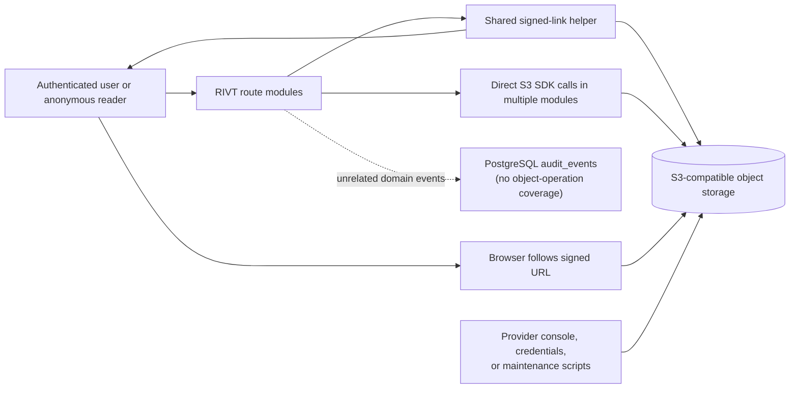
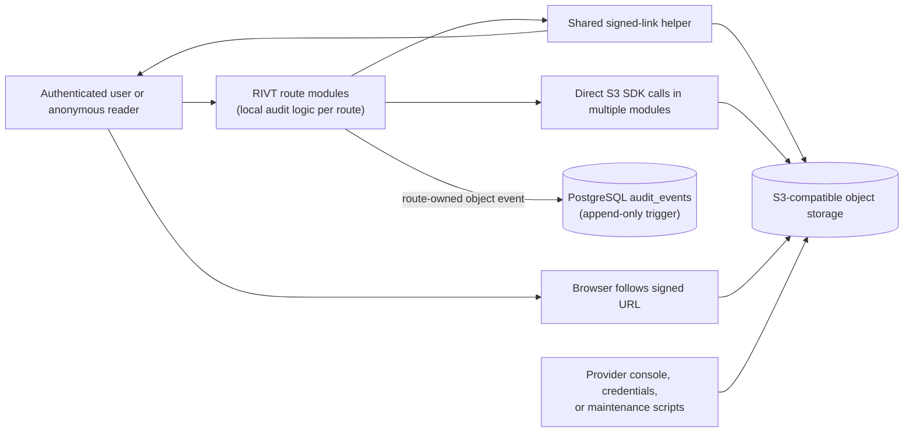
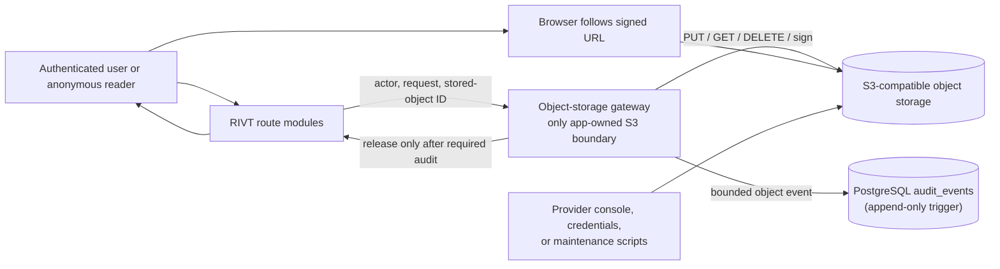
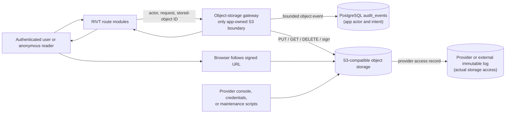

# Security Hardening Proposal: Establish accountable object-storage access

> **Status: proposed design only.** None of the options in this document has
> been implemented. No source, migration, provider setting, bucket, paid
> resource, or production data was changed by this review.

## Decision

We need to choose where RIVT will own the rule that every application-originated
object operation has a bounded, privacy-safe audit event. The immediate choice
is between adding that behavior independently to every route and consolidating
all S3 authority behind one application gateway. A later, separate choice is
whether RIVT needs provider-level or external immutable logging to observe
access that bypasses the application.

The incident evidence does not justify a claim that an object was never read.
It instead shows a specific evidence gap: the existing provider setup and
application logs cannot reconstruct historical per-object access. This
proposal narrows that gap without pretending an application event proves a
browser download or provider-console access.

## Executive Recommendation

The complete option set is:

- **Option 1: Local per-route audit inserts.** Keep direct S3 calls where they
  are and add an `audit_events` insert around every current object operation.
  This is the smallest baseline and requires no new service or table, but the
  security rule remains dependent on each caller remembering it.
- **Option 2: Centralized object-storage gateway using the existing ledger.**
  Route application `PUT`, server-side `GET`, `DELETE`, and signed-link
  issuance through one module that writes bounded rows to the existing
  append-only `audit_events` table. This also requires no new service or table
  and is the recommended application boundary.
- **Option 3: Provider or external immutable access logging.** Retain the
  application gateway for actor context and add a provider-native or external
  immutable log for actual storage access, including access outside RIVT. This
  provides higher forensic assurance but introduces recurring cost, privacy,
  retention, and operational decisions that have not been priced or approved.

I recommend Option 2 under the current constraints. I inspected the direct S3
callers and the existing audit schema at revision
`04360c6dd469908ec0c1e8245d9910163630e72f`; the strongest structural fact is
that the project already has the right append-only application ledger but does
not have one owner for storage authority. A gateway makes omission testable and
lets us keep actor-aware evidence without buying another service. Option 1 is
reasonable only as a short-lived emergency patch. Option 3 becomes preferable
when provider-console or leaked-credential access must be independently
provable and the owner has approved a provider, retention period, privacy
design, and exact cost.

## Evidence

The following evidence IDs are defined here so reviewers do not need to decode
them from the context registry.

| Evidence | Finding or document | What it establishes |
| --- | --- | --- |
| `E01` | [Credential-exposure incident and forensic limits](../../../incidents/2026-07-29-production-credential-exposure.md) | Railway Bucket history available to this incident cannot establish whether an object was downloaded; no misuse indicator was found, but no-access/no-exfiltration cannot be claimed. |
| `E03` | Existing append-only application audit ledger (`migrations/0002_domain_foundation.up.sql`) | `audit_events` already stores request, actor, organization, action, subject, timestamp, and JSON metadata, with a trigger rejecting update and delete. |
| `E04` | Append-only audit-ledger regression coverage (`test/migrations.integration.test.js`) | Existing integration coverage exercises the immutability trigger, making reuse of this ledger source-backed rather than speculative. |
| `E05` | Shared S3 client, signed-link helper, and project media routes (`server/index.js`) | RIVT has a shared signing helper, direct project-media object writes, and a legacy upload mapper that can expose a raw object key and optional public URL. |
| `E06` | Album object operations (`server/albums.js`) | Album upload and link paths use storage authority outside a dedicated storage boundary. |
| `E07` | Shop Talk media operations (`server/shop-talk.js`) | Shop Talk media writes and links are another independent storage caller. |
| `E08` | Anonymous public image links (`server/public-discovery.js`) | Public discovery issues signed image links and the browser subsequently fetches from the storage provider directly. |
| `E09` | Professional-profile objects (`server/professional-profile.js`) | Credential evidence, portfolio media, and avatars create several write, link, replacement, and deletion paths. |
| `E10` | Document-brand objects (`server/document-brand.js`) | Document logos include the normal application-side object read used in invoice and estimate delivery, plus write and delete paths. |
| `E11` | Document delivery caller (`server/tool-records.js`) | Invoice and estimate delivery calls the document-brand read path and therefore needs request context carried into storage auditing. |
| `E12` | Messaging and contact-note attachments (`server/messaging-continuity.js`) | User attachment and system cleanup paths both exercise object authority and need distinguishable initiator context. |
| `E13` | Legacy upload routes (`server/legacy-integrations.js`) | Legacy list, link, and upload behavior either needs the same boundary or explicit retirement. |

**Observed.** `E03` and `E04` show that RIVT already owns a useful append-only
application ledger. `E05` through `E13` show that storage capability is spread
across multiple route modules. `E08` confirms that a signed link shifts the
actual download from the RIVT process to the browser and provider. `E01`
records the incident's historical provider-level visibility limit.

**Inferred.** Because several modules can call the SDK or signing helper
directly, object-audit coverage is currently a convention rather than an
enforced boundary. A local route patch would improve the known paths but would
not make omission difficult for a new caller. A gateway can own the
application invariant, but even a perfect gateway cannot see a later browser
fetch or a call made with provider credentials outside the RIVT process.

**Proposed.** The gateway, action names, metadata allowlist, migration ideas,
and provider-log architecture below are designs. They do not exist merely
because they are documented here.

## Current Design And Failure Mode

RIVT initializes a shared S3-compatible client in `server/index.js`, but the
privileged calls are not confined there. Album, Shop Talk, professional
profile, document-brand, messaging-continuity, and legacy integration modules
instantiate S3 commands directly. Other modules receive a shared signing
function. This is convenient for feature delivery, but it distributes the
decision to audit across every route and cleanup path.

The application can authorize a request correctly and still leave no
object-specific evidence, because its existing domain audit events do not
systematically describe object operations. A signed URL introduces another
boundary: RIVT authorizes and issues the URL, then the browser talks to object
storage directly. The strongest honest application claim is therefore "RIVT
issued access to this stored-object record," not "the object was downloaded."

The principal paths we would have to cover are:

| Area | Application paths that exercise object authority |
| --- | --- |
| Projects | Project-media upload, project detail media links, and explicit media-link endpoint in `server/index.js` |
| Albums | Album list/detail links and album photo upload in `server/albums.js` |
| Shop Talk | Post list/detail/lookup media links and post-media upload in `server/shop-talk.js`; public HTML/API image links in `server/public-discovery.js` |
| Professional identity | Credential evidence, portfolio, and avatar write/link/delete/replacement paths in `server/professional-profile.js` |
| Documents | Brand-logo write/link/delete and delivery read in `server/document-brand.js`, called by `server/tool-records.js` |
| Messaging | Message and contact-note attachment write/link/delete plus expired-draft cleanup in `server/messaging-continuity.js` |
| Legacy | Legacy upload list/link/write behavior in `server/legacy-integrations.js`, unless retired |

Current object keys can contain sanitized original filenames and account
identifiers. That detail is useful for locating provider objects, but it is a
poor audit subject because copying it into a ledger or external access-log
pipeline expands personal-data exposure. The stable application subject should
instead be the UUID of the corresponding `uploads` record or other canonical
stored-object record. `server/index.js` also returns the raw key and an optional
public URL in a legacy mapper. We should verify that `S3_PUBLIC_BASE_URL` is
unset and the bucket is private, then remove or retire those legacy response
fields as part of any selected implementation.

## Desired Invariants

1. Every application-originated object `PUT`, server-side `GET`, `DELETE`, and
   signed-link issuance reaches one auditable control before success is
   released to the caller.
2. Every audit row identifies a canonical stored-object UUID, request ID,
   actor when known, organization when known, operation, scope, result, and
   initiator without storing an object key, URL, filename, credential, header,
   customer-provided label, provider error text, or content.
3. Anonymous public access and system maintenance are explicit initiators, not
   disguised as authenticated user activity.
4. A failed required audit write cannot result in RIVT returning a signed URL
   or releasing server-read bytes.
5. Partial failures after a storage mutation are visible and handled with a
   documented compensation path; an audit failure is never reported as a
   successful upload or delete.
6. New server code cannot directly instantiate object SDK commands or call the
   signing library outside the selected storage boundary.
7. Application events are described as authorization/issuance evidence, never
   as proof of a subsequent direct-to-provider download.
8. Provider-level immutable evidence, if later selected, uses opaque future
   object keys, least-privilege access, approved retention, and an approved
   spending limit.

## Constraints And Non-Goals

- We must preserve existing authorization and object behavior during rollout.
- The current preferred design must not require a new table, service, bucket,
  or paid resource.
- Any migration needs its own review, rollback, and approval. This proposal
  applies none.
- We cannot delete or rewrite historical `audit_events`; rollback stops new
  writes or enforcement but preserves the evidence already recorded.
- We will not log presigned URLs, object keys, filenames, content, credentials,
  authorization headers, provider exceptions, or raw IP addresses.
- We will not claim that app-level signed-link issuance proves a browser
  download.
- Backup and operator scripts are outside the application gateway. They need
  separately owned auditing if their activity must be attributable.
- No measured latency, database-write budget, provider-log retention, or
  provider-log price was supplied. We use a balanced profile and label
  resource effects as source-derived or hypothetical.
- Content scanning, malware detection, object encryption redesign, and a
  provider migration are not goals of this proposal.

## Before Architecture

The current design has a shared client and helper but multiple independent
privileged callers. The dashed components in the diagram are where audit
ownership can drift or where access bypasses the application.

Source: [`object-access-accountability-before.mmd`](../diagrams/object-access-accountability-before.mmd).

The two important edges are browser-to-storage and operator-to-storage. Neither
returns through the RIVT server. Any application-only option leaves those edges
outside its evidentiary boundary, even if it makes every in-app decision
perfectly auditable.

## Options

### Option 1: Local per-route audit inserts

This baseline keeps the current architecture. Each listed route or helper would
insert a bounded row into the existing `audit_events` table around its storage
operation. The strongest case for this approach is speed: no new module or
provider exists, route owners can preserve their local error behavior, and no
schema change is required to begin. It can materially improve incident
evidence for the exact paths we enumerate today.

The weakness is structural. Every direct SDK caller remains capable of
performing an unaudited operation, and a new route can regress coverage simply
by following an existing direct-call pattern. Shared action constants and tests
can reduce that risk, but the ownership boundary still lives in human
discipline. It also repeats transaction and compensation decisions across
features. What gives me pause is not the initial patch size; it is that the
next feature can bypass the control without crossing a deliberately protected
API.

The likely performance effect is one database insert per object event. Link
lists must batch rows in one statement or the page can acquire an N+1 write
pattern. Memory use should remain bounded to the rows already being mapped.
Reliability becomes more complicated because each route must decide whether an
audit failure blocks a link, read, write, or delete and how to compensate after
S3 has already changed.

Rollout can proceed route by route with focused tests, and rollback can remove
the local inserts while preserving rows already written. That reversibility is
attractive for an emergency containment patch. It is less attractive as the
permanent architecture because partially migrated routes are hard to
distinguish from forgotten routes.

Source: [`object-access-accountability-local-route-audits-after.mmd`](../diagrams/object-access-accountability-local-route-audits-after.mmd).

| Change | Before | After | Security consequence | Cost |
| --- | --- | --- | --- | --- |
| Object audit insert | Not systematic | Implemented independently in each current route | Known paths gain actor-aware evidence | Engineering and test work in every route; no new paid service |
| Audit failure behavior | Route-specific and generally absent | Still route-specific | Can fail closed if each implementation is correct | Repeated compensation and error handling |
| New caller enforcement | None | Search/test convention | Regression risk narrows but remains | Ongoing review burden |
| Out-of-band access | Invisible | Invisible | No improvement for browser fetch, console, or leaked credentials | None |

The diagram looks similar to today because it is. The security improvement
comes from repeated local audit edges, not a new authority boundary. We should
select this only if immediate delivery outweighs the known recurrence risk and
we commit to replacing it with Option 2.

### Option 2: Centralized object-storage gateway using the existing ledger

This option creates a single application module, conceptually
`server/object-storage.js`, as the only server code permitted to instantiate
`PutObjectCommand`, `GetObjectCommand`, `DeleteObjectCommand`, or call
`getSignedUrl`. Route modules pass canonical application context to a small API:
`putObject`, `getObject`, `deleteObject`, `issueDownloadUrl`, and a batched
`issueDownloadUrls`.

The gateway would write four bounded action names to the existing ledger:
`storage.object.put`, `storage.object.get`, `storage.object.delete`, and
`storage.object.link_issued`. `subject_type` would be `stored_object`, and
`subject_id` would be the canonical database UUID, never the provider key.
Existing columns carry the request ID, actor account, and organization. The
gateway would construct metadata itself from an allowlist:

- required `scope`, `outcome`, and `initiator`;
- optional nonnegative `byteCount`;
- optional bounded `expiresInSeconds`.

It would reject arbitrary metadata rather than sanitizing a caller-provided
object. That distinction matters: an allowlist prevents a future route from
casually copying a provider exception, URL, or filename into the ledger.
`initiator` would distinguish `actor`, `anonymous`, and `system` operations.
Public discovery would therefore remain honest about anonymous link issuance,
and expired-draft cleanup would remain honest about system deletion.

The security gain comes from capability ownership. A recursive security test
can reject direct object SDK commands and signing calls anywhere under
`server/` except the gateway. This does not make the S3 client a cryptographic
sandbox—the process still holds credentials—but it turns audit omission from
an easy local choice into a visible architectural violation. It also gives us
one place to define fail-closed behavior:

- no signed URL is returned if its audit insert fails;
- server-read bytes are not released if auditing fails;
- list-page links are audited in one bulk database insert, one row per object;
- provider failures can record `outcome: "failed"` without serializing the
  exception;
- a `PUT` or `DELETE` may have already changed S3 before PostgreSQL fails, so
  the request returns a safe failure, monitoring receives only safe IDs, and
  existing compensating delete behavior is retained where applicable.

This is the option with the best balance of control and cost, but we should be
honest about two tradeoffs. First, a database outage can now block reads or link
issuance if we enforce the invariant strictly. That is deliberate fail-closed
behavior, but it couples storage availability to the audit ledger. We need
metrics for audit-insert latency and failure rate, plus an incident playbook
that never silently disables auditing to restore service. Second, the gateway
does not observe a browser's eventual signed-URL request. It records the
authorized issuance, which is valuable, but not equivalent to provider access
evidence.

No new table or paid service is needed. An initial gateway can use the present
schema. A later, separately reviewed migration could add a `NOT VALID` then
validated `CHECK` constraint that restricts `storage.object.*` action names,
subject shape, metadata keys, enums, byte count, and expiry. That constraint is
defense in depth, not a prerequisite for the gateway, and this proposal does
not create it. Rollback can route features back to their prior implementations
while leaving immutable audit rows intact. A per-route rollout flag or adapter
allows one feature at a time to migrate without a big-bang cutover.

Source: [`object-access-accountability-central-gateway-after.mmd`](../diagrams/object-access-accountability-central-gateway-after.mmd).

| Change | Before | After | Security consequence | Cost |
| --- | --- | --- | --- | --- |
| S3 authority | Spread across route modules | Owned by one application gateway | New callers cannot silently bypass audit without violating a testable boundary | Moderate refactor across storage callers |
| Audit schema | Existing append-only domain ledger | Same table with four bounded object actions | Reuses proven immutability and actor context | One batched insert per link list; no new table or service |
| Sensitive metadata | Caller-dependent | Gateway-owned allowlist | Keys, URLs, filenames, credentials, and provider errors stay out of the ledger | Validation and regression-test work |
| Failure behavior | Inconsistent | Central fail-closed and compensation rules | A link/read is not released without its required event | Database availability joins the critical path |
| Out-of-band access | Invisible | Still invisible | Honest boundary: issuance and app operations only | Provider logging remains a separate decision |

The important delta is the route-to-gateway edge. All app-owned storage
authority and audit policy now meet there. The browser and operator edges
remain outside, which is why Option 2 is a strong application control rather
than a complete forensic solution.

### Option 3: Provider or external immutable access logging

This higher-assurance option keeps the Option 2 gateway for application actor
context and adds provider-native storage access logs or an external immutable
security-log sink. Its strongest case is that it can record the storage access
itself, including a browser using a signed URL and potentially provider-console
or direct-credential activity. It is the only option here that materially
addresses the historical visibility limitation in `E01`.

The added record has a different meaning from `audit_events`. The application
ledger explains *who RIVT authorized and why*; the provider record explains
*what reached object storage*. Neither should replace the other. Correlation
would use a privacy-safe object identifier or a protected mapping, not a
presigned URL. We should not emit account IDs or original filenames into an
external sink merely to make correlation convenient.

What gives me pause is the set of decisions hidden behind the word
"immutable." We have not verified that the current Railway Bucket offering
exposes a suitable native access-log stream, what external destination would
be required, whether object lock or versioning is available, how much
ingestion/storage/egress costs, or which deletion and retention obligations
apply. External access logs can themselves become a sensitive dataset because
current object keys may contain sanitized filenames and account identifiers.
Before enabling them, future keys should become opaque UUID-only and access to
the log should be more restricted than ordinary application logs.

This option introduces additional availability and operability questions. The
storage provider must not fail customer object access merely because a
secondary export sink is temporarily unavailable, so provider delivery likely
needs buffering and retry. That creates delayed evidence and requires alerts
for delivery lag. Retention or object-lock choices can make data intentionally
hard to delete, which is beneficial for incident response but must be reconciled
with privacy and legal deletion requirements. Rollback can disable future
delivery after approval, but it cannot promise immediate removal of already
locked or retained records.

No exact cost is claimed. Before selection, the owner needs a written quote or
provider calculator result for expected request volume, log volume, storage
duration, query operations, egress, and any separate service. This option must
not be enabled under an assumed "free" tier.

Source: [`object-access-accountability-provider-immutable-after.mmd`](../diagrams/object-access-accountability-provider-immutable-after.mmd).

| Change | Before | After | Security consequence | Cost |
| --- | --- | --- | --- | --- |
| Actual storage access evidence | None available to the incident review | Provider or external access record | Can observe direct-to-provider and out-of-band access, subject to provider coverage | Unknown recurring ingestion, storage, query, and possible egress cost |
| Application intent | Not systematic | Central gateway plus `audit_events` | Actor-aware authorization can be correlated with storage access | Option 2 engineering cost remains |
| Object identity in logs | Current keys may include identifying text | Future opaque keys and protected correlation | Reduces log-based personal-data exposure | Key-format migration and compatibility work |
| Evidence retention | Provider default/unknown | Approved immutable or tamper-resistant retention | Stronger incident evidence | Privacy, deletion, access-control, and legal review |
| Export failure | Not applicable | Buffered/retried provider delivery | Storage can remain available while evidence delivery is monitored | New alerting and recovery burden |

The new purple edge is the decisive difference: the provider emits evidence
after storage receives access. This closes more of the forensic gap but creates
a new security system that must be protected, monitored, paid for, and governed.

## Comparison

The options do not receive a composite score because the right answer depends
on whether we are optimizing for immediate application accountability or
provider-level forensic proof.

| Dimension | Option 1: Local route inserts | Option 2: Central gateway | Option 3: Provider/external immutable logging |
| --- | --- | --- | --- |
| Security | Improves known route evidence; omission remains easy | Strong app boundary; issuance/app operations covered; out-of-band access remains | Highest evidence coverage when combined with gateway; introduces a new sensitive log system |
| Performance | One insert per event; N+1 risk unless lists batch | One insert per event with one owned batching path | Adds provider-side logging/export; latency effect depends on asynchronous delivery |
| Memory | Bounded local event values | Bounded gateway values and batched row list | Provider buffers/export pipeline and query system may retain more state |
| Reliability | Repeated route-specific fail/compensation logic | Database audit availability joins storage response path; centrally testable | Export lag, retry, and sink availability become operational concerns |
| Operability | Many callers to inspect during incidents | One application boundary, metrics, and action taxonomy | New provider controls, retention, access reviews, cost alerts, and delivery monitoring |
| Migration | Small changes repeated across every route | Moderate refactor with adapters or per-route rollout; no new table required | Foundational provider/privacy/cost project after Option 2 |
| Recurring cost | No new paid resource expected | No new paid resource expected | Unknown and potentially material; approval required |
| Forensic limit | Cannot see browser or direct credential access | Cannot see browser or direct credential access | Can improve actual-access evidence, subject to provider guarantees |
| Rollback | Revert local code; keep rows | Route back through adapters; keep rows | Stop future export after approval; retained/locked evidence may not be erasable |

Option 1 minimizes near-term code movement but maximizes the chance that we
repeat this discussion for each future route. Option 2 asks for more deliberate
engineering once and keeps the runtime within systems RIVT already operates.
Option 3 is not "Option 2 but better" for free; it is a distinct assurance and
governance commitment. A measured gateway rollout should establish the
application boundary before we evaluate whether external evidence is worth
its ongoing cost.

## Recommendation

I recommend Option 2: centralize all application-owned object authority in a
gateway and write privacy-safe rows to the existing append-only
`audit_events`. It addresses the structural recurrence risk identified in the
source, preserves current deployment boundaries, avoids a new table and paid
service, and makes future bypass mechanically detectable.

We should keep Option 1 only as a temporary fallback if delivery time proves
too constrained for a route-by-route gateway migration. If that happens, the
local inserts should use the same action names and metadata contract so they
can be moved behind the gateway without rewriting evidence semantics.

Option 3 should be reconsidered after the gateway is operating and after the
owner answers the provider, privacy, retention, and budget questions. It should
win sooner if RIVT's launch requirement becomes: "we must independently
reconstruct provider-console, leaked-credential, and signed-URL access." It
should not be enabled merely to make the current incident feel complete;
provider logging cannot retroactively reconstruct access that was never
recorded.

## Evidence Coverage And Residual Risk

| Evidence | Option 1 | Option 2 | Option 3 | Tactical work still required |
| --- | --- | --- | --- | --- |
| `E01` — Incident object-access visibility gap | Mitigates app events only | Mitigates app events and prevents caller drift | Addresses future provider-access evidence, subject to provider guarantees | Keep incident wording honest; historical access remains unrecoverable |
| `E03` — Existing append-only application ledger | Reuses | Reuses as the central application ledger | Reuses alongside external evidence | Preserve trigger and existing rows |
| `E04` — Ledger immutability coverage | Extends | Extends | Extends | Add object-action and rollback coverage if a constraint is later selected |
| `E05` — Shared helper/project media/raw legacy fields | Local audit only | Moves authority to gateway | Gateway plus provider evidence | Remove raw key/public URL response fields; verify bucket private and public base URL unset |
| `E06` — Album operations | Local audit only | Routes through gateway | Gateway plus provider evidence | Preserve upload/link behavior and batch list audits |
| `E07` — Shop Talk media | Local audit only | Routes through gateway | Gateway plus provider evidence | Preserve private/community authorization |
| `E08` — Anonymous public image links | Logs issuance, not fetch | Logs anonymous issuance, not fetch | Can log provider fetch | Keep public access explicitly anonymous and avoid claiming a download from issuance |
| `E09` — Profile, credential, portfolio, and avatar objects | Local audit only | Routes through gateway | Gateway plus provider evidence | Do not copy credential labels, filenames, or keys into metadata |
| `E10` — Document-logo read/write/delete | Local audit only | Routes through gateway | Gateway plus provider evidence | Carry request/actor context into delivery reads |
| `E11` — Invoice/estimate delivery caller | Local audit only | Supplies context to gateway | Gateway plus provider evidence | Preserve delivery behavior and safe logo fallback |
| `E12` — Messaging and note attachments | Local audit only | Routes through gateway with actor/system initiator | Gateway plus provider evidence | Preserve cleanup compensation and identify system deletions |
| `E13` — Legacy upload routes | Local audit or retirement | Gateway or retirement | Gateway/retirement plus provider evidence | Decide whether these routes remain supported |

Residual risks remain after Option 2:

- a signed-link audit proves issuance, not download;
- provider console, direct credential use, backup scripts, and maintenance tools
  remain outside the application gateway;
- the PostgreSQL owner or superuser can disable the append-only trigger;
- the ledger is not cryptographically chained or stored in external WORM
  storage;
- a database outage can deny object reads or links if the application correctly
  fails closed;
- storage mutations and audit inserts cannot share one atomic transaction, so
  compensation and reconciliation remain necessary;
- historical access during the 2026-07-29 incident cannot be recovered by a
  future design.

## Migration And Rollout

No rollout is authorized by this document. If Option 2 is selected, the safest
sequence is a compatibility migration rather than a big-bang rewrite:

- define and test the audit taxonomy and bounded metadata constructor;
- introduce the gateway behind existing interfaces without changing route
  authorization;
- migrate server-read document logos first because this path returns bytes
  through RIVT and has clear fail-closed semantics;
- migrate single-object signed-link endpoints, then batched list/detail links;
- migrate uploads and deletions with compensation tests;
- migrate anonymous public discovery with `initiator: "anonymous"`;
- migrate expired-draft cleanup with `initiator: "system"`;
- retire or migrate legacy upload routes;
- add a security test that forbids direct SDK and signing calls elsewhere;
- verify runtime privacy assumptions, including a private bucket and no public
  base URL;
- only then consider a separate, reviewed database constraint.

The gateway can initially wrap the existing client and signing helper so route
responses remain compatible. During each slice, the test suite should prove
both successful behavior and an audit row containing only approved fields. We
must avoid dual-auditing one operation during transition; route adapters should
have exactly one active audit owner.

Rollback must never delete audit events. A route can be switched back to its
prior adapter if the gateway causes an availability regression, while incident
review records the temporary loss of the invariant. A failed provider mutation
must retain safe reconciliation data using canonical object IDs, not provider
keys in general logs.

Option 3 requires a separate rollout plan after a provider is selected. Before
any access-log export, future object keys should be opaque, retention and
deletion rules should be approved, cost alerts should be configured, and a
non-production event should prove both delivery and redaction. Object lock or
irreversible retention must not be enabled without legal/privacy review and
explicit owner approval.

## Validation Plan

The selected implementation should not be accepted until these checks pass:

| Area | Workload and metric | Acceptance boundary |
| --- | --- | --- |
| Security boundary | Recursive static scan of `server/` | Direct `PutObjectCommand`, `GetObjectCommand`, `DeleteObjectCommand`, and `getSignedUrl` imports/usages exist only in the gateway |
| Metadata privacy | Unit tests with URLs, keys, filenames, credentials, headers, provider errors, and cyclic objects | Disallowed values are rejected before S3 or absent from every serialized audit value |
| Link fail-closed | Force audit insert failure after signing | No URL or link-bearing response is returned |
| Server read fail-closed | Force audit insert failure on document-logo read | No object bytes are released; caller receives the approved safe failure/fallback |
| Batch behavior | Project, album, profile, and Shop Talk lists with many media rows | One bulk audit insert per response, one row per issued object; no N+1 database writes |
| Upload/delete partial failure | Simulate S3 success followed by database failure | Safe failure returned; compensation/reconciliation behavior is deterministic and logs only safe IDs |
| Existing functionality | Project, album, Shop Talk, profile, document, messaging, public-discovery, and legacy tests | Authorization and successful user-visible behavior remain unchanged |
| Database protection | Integration test against reviewed migration, if selected | Compliant rows succeed; disallowed metadata fails; update/delete remains blocked; rollback drops only the new constraint |
| Latency | Compare route p50/p95 before and after on representative link lists and uploads | Threshold must be agreed before implementation; no unmeasured "negligible" claim |
| Reliability | Observe audit insert latency/failure and gateway error counts during staged rollout | No silent bypass; alerts fire on sustained failure; rollback is rehearsed |
| Provider logging, if selected | One non-production signed-link access and one controlled administrative read | Both appear with approved fields, documented delay, and no URL/credential/customer content |
| Cost, if selected | Provider estimate plus bounded test usage | Owner approves the full monthly ceiling before enabling production delivery |

Repository verification would still include the project-required build, lint,
test, browser E2E, and production dependency audit. Those broad checks do not
replace the focused boundary and privacy tests above.

## Implementation Work Packages

These are proposal-level packages, not authorization to edit source:

- **Gateway contract and privacy types:** define operation context, action
  taxonomy, enums, and a gateway-owned metadata allowlist.
- **Gateway behavior and unit tests:** implement object operations, batched link
  events, fail-closed reads/links, safe failed outcomes, and compensation hooks.
- **Read/link migration:** route project, album, Shop Talk, public discovery,
  profile, document, messaging, and legacy link paths through the gateway.
- **Write/delete migration:** route uploads, replacements, cleanup, and
  deletions through the gateway while preserving authorization and
  compensation.
- **Enforcement:** add the recursive direct-SDK security test and remove direct
  storage authority from feature modules.
- **Legacy and runtime cleanup:** decide legacy route retirement; remove raw
  key/public URL response fields; verify the bucket remains private and
  `S3_PUBLIC_BASE_URL` is unset.
- **Optional ledger policy migration:** only after separate review, add a
  rollback-safe constraint for the four action names and safe metadata schema;
  do not create a second audit table.
- **Optional provider assurance:** only after separate provider, privacy,
  retention, and cost approval, evaluate immutable access logging with opaque
  keys and bounded rollout.

## Open Questions

- Is application-level actor and issuance evidence sufficient for launch, or
  is provider-level proof of actual object access a launch requirement?
- What maximum additional database latency is acceptable for list-page link
  issuance and server-side document reads?
- Should legacy upload routes be migrated or retired?
- Is `S3_PUBLIC_BASE_URL` absent in every production/staging environment, and
  is the bucket policy private?
- Which canonical database record represents document logos, avatars, and
  other objects that may not currently use `uploads.id` directly? If needed,
  should a generalized stored-object registry be introduced later, or can
  existing UUID records be used without a new table?
- How long should application object-audit events be retained, and who may
  query them?
- If provider logging is selected, which provider and sink meet required
  access logging, immutability, residency, retention, deletion, and export
  guarantees?
- What is the exact monthly cost at expected request volume, including
  ingestion, storage, queries, and egress?
- Must maintenance and backup scripts enter the same gateway, or will they
  receive a separately reviewed service identity and audit path?
