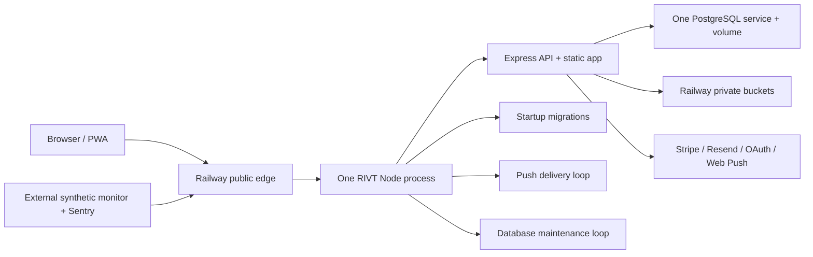
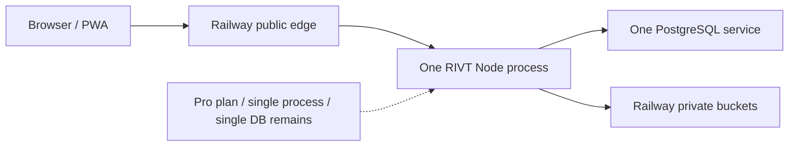
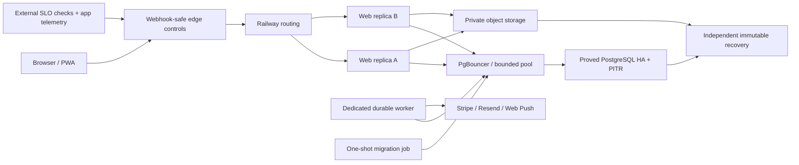
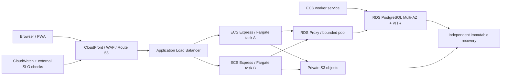

# Security Hardening Proposal: Production hosting posture

## Decision

Stay on Railway and harden it in measured, reversible stages. Do not move the
whole RIVT platform to AWS now.

## Executive Recommendation

The complete decision set is Option 1, keep the single-node baseline;
Option 2, harden Railway first; and Option 3, migrate the full platform to AWS
now. I recommend Option 2 under the current evidence. Option 3 becomes
preferable only after a recorded control, reliability, capacity, operating,
or fully loaded cost trigger.

This is not approval to upgrade Railway, create replicas, enable HA/PITR,
change DNS, add an edge provider, run a charge-bearing load test, or create
AWS resources. Each live stage requires an explicit owner approval naming the
configuration, maximum incremental cost, expiration, and rollback.

The decision is based on current evidence:

- production is a small single-region, single-replica Railway topology;
- the app/data footprint is small;
- the launch plan is controlled;
- no measured traffic or load result shows Railway is exhausted;
- Railway has a simpler operating model at RIVT's current size;
- the current topology is not launch-grade and must be hardened;
- an AWS move would add networking, IAM, container registry, deployment,
  database migration, observability, and cutover work before it solves the
  application-process and recovery gaps;
- AWS App Runner is closed to new customers, so the supported AWS comparison
  is ECS Express Mode/Fargate plus RDS Multi-AZ, not App Runner.

## Evidence

The source collection and its limitations are recorded in
[context](../context.md).

| Evidence | Finding or document | What it establishes |
| --- | --- | --- |
| `RP92-E007` | [Independent recovery activation decision](../../../../delivery/packets/91_RECOVERY_ACTIVATION_DECISION.md) | A separate immutable recovery boundary is selected but not activated. |
| `RP92-E008` | [Security and infrastructure assessment](../../../SECURITY_INFRASTRUCTURE_ASSESSMENT.md) | Live production was observed on Railway Hobby with one application replica, one PostgreSQL replica, and one region; WAF/CDN controls were not enabled. |
| `RP92-E014` | [Express runtime and startup](../../../../../server/index.js) | One source process starts HTTP, migrations, push delivery, and maintenance with a default 10-connection database pool. |
| `RP92-E015` | [Serialized migration runner](../../../../../server/migrations.js) | Migrations use a PostgreSQL advisory lock. |
| `RP92-E016` | [Per-process database maintenance](../../../../../server/database-maintenance.js) | Every application process starts its own bounded maintenance timer. |
| `RP92-E017` | [Durable push worker](../../../../../server/push-notifications.js) | Push work is transactionally claimed with `FOR UPDATE SKIP LOCKED`. |
| `RP92-O003` | [Current recovery footprint](../context.md) | The recorded database and object footprint is small, but footprint is not traffic capacity. |
| `RP92-O005` | [Jacksonville controlled rollout](../../../../launch/JACKSONVILLE_SOFT_LAUNCH_SCRIPT.md) | The plan describes about 35 early invitees; this is not a concurrency forecast. |
| `RP92-O006` | [Owner-supplied Pro activation evidence](../context.md) | Railway Pro is active; this does not prove a changed topology, HA/PITR, edge controls, support SLO, or product availability. |
| `RP92-G001` | [Nationwide launch capacity gap](../../../../product/NATIONWIDE_FINAL_LAUNCH_AUDIT_2026-07-09.md) | No request, concurrency, latency, resource, growth, load-test, or numeric availability evidence is recorded. |
| `RP92-P001` | [Railway plans and pricing](https://docs.railway.com/pricing/plans) | Published prices support a formula, not the final RIVT HA bill. |
| `RP92-P002` | [Railway scaling and replicas](https://docs.railway.com/deployments/scaling) | Railway vertical scaling follows plan limits; replica count is manually configured and sticky sessions are unsupported. |
| `RP92-P010` | [Railway support](https://docs.railway.com/platform/support) | Hobby support is community-only; Pro direct support normally has no SLO. |
| `RP92-P011` | [AWS App Runner availability change](https://docs.aws.amazon.com/apprunner/latest/dg/apprunner-availability-change.html) | AWS App Runner is closed to new customers; ECS Express Mode is the current AWS comparison. |
| `RP92-P014` / `RP92-P016` | [RDS Multi-AZ](https://docs.aws.amazon.com/AmazonRDS/latest/UserGuide/Concepts.MultiAZSingleStandby.html) and [RDS SLA](https://aws.amazon.com/rds/sla/) | Managed synchronous standby and a database-component SLA do not establish end-to-end RIVT availability. |
| `RP92-P017` / `RP92-P018` | [Fargate pricing](https://aws.amazon.com/ecs/pricing/) and [ALB pricing](https://aws.amazon.com/elasticloadbalancing/pricing/) | These support the theoretical web-layer floor; RDS and the rest of the platform remain unpriced. |

I inspected the named repository sources, existing operational evidence, and
official provider documentation. The coupled process composition
(`RP92-E014`/`RP92-E016`) and the complete absence of measured capacity and
SLO evidence (`RP92-G001`) most strongly drive the structural recommendation.

Observed facts:

- Packet 88 observed one app replica and one PostgreSQL replica in
  `us-east4`; owner-supplied evidence now shows Pro active but does not show
  that the topology changed;
- one source process starts the HTTP server, migrations, push delivery, and
  database maintenance;
- each source process defaults to a 10-connection PostgreSQL pool;
- migration execution uses an advisory lock and push delivery uses
  `FOR UPDATE SKIP LOCKED`;
- maintenance uses a per-process interval;
- no capacity baseline, SLO dashboard, load result, failover result, or
  provider failure-domain contract exists.

## Current Design And Failure Mode

Inferred consequences:

- adding replicas before process-role work multiplies database pools and
  maintenance timers;
- coordination-aware source is not equivalent to a tested multi-replica
  deployment;
- a small database/object footprint does not prove traffic capacity;
- a provider SLA or limit is not an end-to-end RIVT SLO.

## Desired Invariants

1. No single application-process failure makes RIVT unavailable.
2. Web replicas remain stateless; canonical sessions and domain state remain
   server-owned in PostgreSQL/private storage.
3. Migrations run exactly once per deployment before traffic is accepted.
4. Push/maintenance work is durably claimed and can recover after worker
   termination without duplicate user-visible effects.
5. The maximum possible database connection count is explicit and stays
   below an approved database budget.
6. An acknowledged database write has a documented loss bound and a tested
   failover path.
7. Point-in-time restore and independent database-plus-object recovery are
   separate, tested controls.
8. Edge controls do not challenge or silently drop signed Stripe/provider
   webhooks.
9. Capacity and spend have hard approval ceilings; autoscaling cannot create
   unbounded cost.
10. RIVT has a measured product SLO and error budget independent of provider
    marketing.
11. The selected platform has a rehearsed exit path, but no migration occurs
    without a trigger.

## Constraints And Non-Goals

- Do not spend money or mutate a provider without explicit owner approval.
- Do not treat the published platform limit as a measured application limit.
- Do not change the 24-hour RPO/four-hour RTO in this packet.
- Do not expose user data in telemetry or use real customer data in synthetic
  load tests.
- Do not introduce dual-running AWS infrastructure merely to claim
  portability.
- Do not promise region-level availability until database, object, DNS,
  webhook, and recovery behavior are all proved.

The initial product SLO below is **proposed**, not yet an owner-approved
customer promise.

- core authenticated read/write availability: 99.9% over a rolling 30 days;
- error budget: 43 minutes 12 seconds per 30 days;
- recovery: retain the approved 24-hour RPO and four-hour RTO until the owner
  explicitly changes them;
- critical webhooks: signature-verified, durable/idempotent, observable, and
  reconciled after delivery failures;
- latency: collect a real seven-day baseline before setting a customer-facing
  latency SLO.

For the proving load test only, proposed engineering gates are:

- pilot profile: 35 concurrent authenticated sessions for 30 minutes;
- headroom profile: a 10× synthetic profile, 350 concurrent sessions, for 10
  minutes;
- no authorization, isolation, idempotency, data-integrity, or lost-webhook
  failure;
- HTTP 5xx rate no greater than 0.1% excluding explicitly injected upstream
  faults;
- no monotonic push/outbox, database-wait, or connection backlog;
- 30% resource headroom at the end of the pilot profile;
- upload tests respect the configured byte/count limits and measure peak
  memory because upload bodies are buffered in process.

The 35/350 concurrency, 0.1%, and 30% values are conservative proposed
tunables, not observed user behavior or provider facts. Latency pass/fail
must be set from the seven-day baseline rather than invented here.

## Before Architecture

The single process in this diagram owns public serving and background
responsibilities. That coupling is the first boundary we must change before
replication.



## Options

### Option 1: Keep the single-node baseline



#### Architecture delta

| Change | Before | After | Security consequence | Cost |
| --- | --- | --- | --- | --- |
| Runtime | One coupled application process | Unchanged | The application process remains a single failure point. | No incremental provider cost. |
| Database | One PostgreSQL service | Unchanged | Database and regional failure exposure remain. | No incremental provider cost. |
| Edge/recovery | Unproved edge and recovery posture | Unchanged | Existing launch blockers remain open. | No incremental provider cost. |

#### What it changes

No topology change. Continue one app process, one database process, and one
region on the now-active Pro plan.

#### Tradeoffs

| Dimension | Assessment |
| --- | --- |
| Security | Existing application controls remain, but there is no additional edge/failure-domain containment. |
| Performance | Lowest provider cost and least overhead; no measured capacity guarantee. |
| Memory | One 10 MiB in-memory upload can materially affect a small process; concurrency is unmeasured. |
| Reliability | A process/database/region failure can interrupt all users. No HA/PITR/failover proof. |
| Operability | Simplest day to day, but plan activation does not create a support SLO and the founder owns every recovery. |
| Migration | No migration effort, but deferred readiness work grows with usage. |

#### Residual risks

- [`R-055` — unverified edge, redundancy, HA, capacity, and autoscaling](../../../../delivery/RISKS.md)
  remains fully open.
- The topology cannot meet the desired no-single-process invariant.
- No contractual or demonstrated database failure domain exists.
- Public launch would rely on hope instead of measured failure evidence.

#### Decision

Reject as the public-launch target. It may remain the current production
topology only while public launch stays blocked and no paid change is
approved.

### Option 2: Harden Railway first



#### Architecture delta

| Change | Before | After | Security consequence | Cost |
| --- | --- | --- | --- | --- |
| Runtime roles | One process serves traffic and runs background work | Fail-closed web, worker, maintenance, and migrate roles | Limits duplicate work and makes replica behavior testable. | Source work first; provider cost only after approval. |
| Web serving | One web process | Two tested web replicas | Removes one application-process failure point after proof. | Second replica uses metered CPU/RAM. |
| Database | One PostgreSQL service | Proved HA/PITR topology behind a bounded pool | Can reduce database failure exposure; exact durability remains a provider/test gate. | Requires a staged quote. |
| Edge/recovery | Unproved edge and platform-bound recovery | Webhook-safe edge plus independent immutable recovery | Adds abuse containment and a separate administrative recovery boundary. | External services require separate approval. |
| Evidence | No capacity/SLO/load proof | Seven-day baseline, SLO, load/failover/recovery evidence | Replaces assumptions with measured launch gates. | Synthetic test cost is capped before execution. |

#### What it changes

1. Establish a seven-day traffic/resource baseline without provider mutation.
2. Add explicit `web`, `worker`, and `migrate` process roles.
3. Prove multi-replica behavior locally and in an approved non-production
   environment.
4. Obtain a written/staged Railway quote for Pro, two web replicas, one worker,
   connection pooling, HA PostgreSQL, PITR, monitoring, and storage.
5. Only after approval, activate the smallest configuration that passes the
   SLO, load, failover, recovery, and cost gates.
6. Add webhook-safe edge protection. Browser challenges may cover browser
   page traffic; signed webhooks must bypass challenges but remain protected
   by exact route, method, signature, size, and rate controls.
7. Retain Packet 91's independent off-Railway immutable-recovery plan.

Railway's vertical scaling is automatic only up to configured plan limits.
Horizontal replicas are manually configured. Therefore this option uses
fixed minimum capacity plus alerts/runbooks first; it does not claim automatic
horizontal scaling.

#### Required source work before replicas

- make process role explicit and fail closed on invalid production roles;
- prevent web replicas from running periodic maintenance;
- run migrations as one pre-deploy/one-shot job under the existing advisory
  lock, then require readiness to observe the expected migration version;
- keep push delivery durable and separately prove reclaim, duplicate
  suppression, and shutdown;
- set pool size per role and prove
  `sum(role replicas × role pool max) + administrative reserve` stays below
  the approved database connection budget;
- add structured measurements for request duration, status class, pool wait,
  pool use, event-loop lag, upload bytes/memory, worker backlog/age, and
  shutdown duration without PII;
- add exact build/role/version signals to readiness.

#### Tradeoffs

| Dimension | Assessment |
| --- | --- |
| Security | Preserves current private service networking and reduces single-process exposure. Edge rules and independent backups still require separate proof. |
| Performance | Two web replicas and pooling add headroom; HA replication and a proxy can add write/connection latency. Load test must measure it. |
| Memory | Role separation avoids running worker loops in every web process. In-memory uploads still require concurrency budgeting or future streaming. |
| Reliability | Improves process and database resilience if Railway's HA topology and failover meet the written contract and tests. It does not automatically provide region-independent operation. |
| Operability | Lower migration burden than AWS, but Railway database templates are operator-managed and Pro support usually lacks an SLO. RIVT retains ownership of database validation. |
| Migration | Incremental and reversible; the app remains portable Node/PostgreSQL/S3-compatible software. |

#### Cost model

Published Railway rates support a formula, not an exact HA quote:

```text
Railway usage =
  ($20 × average vCPU-months)
+ ($10 × average RAM GB-months)
+ ($0.05 × service-egress GB)
+ ($0.15 × volume GB-months)
+ ($0.015 × rounded bucket GB-months)

Monthly bill =
  max($20 Pro minimum, Railway usage)
+ external edge/monitoring/backup
+ tax
```

The Pro minimum includes the first US$20 of Railway resource usage. Actual HA
PostgreSQL cost depends on the measured CPU/RAM/volume/egress of all database,
consensus, proxy, and backup services. It must be staged in the Railway
dashboard and approved before activation.

#### Acceptance

- product SLO and owner cost ceiling approved;
- web/worker/migrate roles pass unit/integration/failure tests;
- two web replicas pass rolling deploy, one-replica termination, session,
  upload, and webhook tests;
- connection budget is documented and stays under the approved maximum;
- database failover runs twice with documented acknowledged-write behavior;
- PITR restores into an isolated target;
- independent database/object restore satisfies the RPO/RTO;
- edge rules pass browser abuse and signed-webhook tests;
- pilot and 10× profiles pass within the approved cost ceiling;
- alerts route for SLO burn, resource headroom, database saturation,
  replication/failover, worker backlog, and backup/restore failure;
- rollback to the last known one-replica application and database topology is
  rehearsed without destroying recovery evidence.

#### Residual risks

- Railway public documentation does not establish RIVT's exact database
  failure domains, failover data-loss bound, or contractual application SLA.
- A same-region topology remains exposed to a regional incident.
- Railway Pro support is usually within 72 hours and explicitly excludes an
  SLO; Business Class/Enterprise support is materially more expensive.
- Manual horizontal scaling requires maintained headroom and a human runbook.
- Platform/account compromise still requires independent recovery.

#### Decision

Select. It provides the best current balance of reliability, cost,
reversibility, and founder operating burden. Selection authorizes the
repository implementation plan only; no provider/cost action is authorized.

### Option 3: Migrate the full platform to AWS now

The strongest case for this option is a future requirement for managed
multi-AZ database operations, richer IAM/network controls, contractual
service components, or automatic horizontal scaling that Railway cannot meet
at an approved cost. Its control mechanism is explicit AWS ownership:
CloudFront/WAF and ALB at the edge, isolated ECS task roles, RDS Multi-AZ,
private S3, centralized logs, and infrastructure as code.

That stronger control surface also creates the largest immediate failure
surface. RIVT would have to migrate database and object state, rotate secrets,
preserve signed webhook behavior, operate two providers during cutover, and
rehearse a weighted-DNS rollback while also making the same replica-safe
source changes required by Option 2. Aggregate memory, cross-AZ latency,
network charges, operational labor, and migration risk are therefore measured
acceptance inputs rather than assumed improvements.



#### Architecture delta

| Change | Before | After | Security consequence | Cost |
| --- | --- | --- | --- | --- |
| Runtime/edge | Railway edge and one Node process | CloudFront/WAF, ALB, and multiple ECS tasks | Adds managed edge and task isolation but substantially expands IAM/network configuration risk. | Fargate, ALB, WAF/CloudFront, logs, and transfer. |
| Database | Railway PostgreSQL service | RDS PostgreSQL Multi-AZ/PITR with bounded pooling | Adds managed Multi-AZ database operations after migration proof. | RDS quote required. |
| Objects/recovery | Railway objects plus planned independent copy | S3 plus independent immutable recovery | Adds native object controls but still needs separate recovery administration. | S3, requests, transfer, and recovery storage. |
| Migration | No cross-provider cutover | Database/object copy, secret rotation, CI/CD, and weighted DNS | Introduces data-divergence, webhook, and rollback risk during transition. | Engineering, dual-running, and support cost. |

#### What it changes

- add an explicit OCI image/Dockerfile and image supply-chain controls;
- provision ECS Express Mode/Fargate, ALB, networking, autoscaling, IAM,
  secrets, ECR, logging, Route 53/ACM, and WAF/CloudFront;
- migrate PostgreSQL to RDS Multi-AZ with PITR;
- migrate object bytes to S3;
- introduce infrastructure as code, environment promotion, cost budgets, and
  an AWS incident/restore operating model;
- perform dual-running validation and weighted DNS cutover with rollback.

AWS App Runner is not an option for a new RIVT customer because AWS closed it
to new customers and recommends ECS Express Mode.

#### Tradeoffs

| Dimension | Assessment |
| --- | --- |
| Security | Rich IAM/network/WAF/KMS controls and a managed Multi-AZ database, but a much larger configuration surface. Misconfiguration risk moves rather than disappears. |
| Performance | More tunable and automatically horizontally scalable; ALB/VPC/proxy layers and cross-AZ database replication add latency/cost that must be measured. |
| Memory | Task sizing is explicit; the current in-memory upload design still needs task-level headroom or streaming. |
| Reliability | RDS Multi-AZ has a 99.95% component SLA and synchronous standby, but that does not make the entire RIVT service 99.95%. |
| Operability | RDS manages more database operations, while ECS/VPC/IAM/WAF/CloudWatch/Route 53 create substantially more founder and incident work. |
| Migration | Highest risk and effort: database/object copy, secrets, CI/CD, DNS, rollback, and parallel provider operation. |

#### Cost model

```text
AWS monthly =
  Fargate tasks
+ ALB and LCUs
+ RDS Multi-AZ, storage, I/O, and backups
+ S3 requests/storage/transfer
+ WAF/CloudFront
+ ECR
+ CloudWatch
+ Route 53, secrets, and KMS
+ support
+ tax
```

A theoretical pair of continuously running minimum Fargate tasks is about
US$18.02/month in `us-east-1`; the ALB hourly floor is about
US$16.43/month before LCUs. That places the theoretical web-layer floor near
US$34.45/month before RDS, WAF/CDN, storage, logs, transfer, backup, support,
or sensible production sizing. RDS requires a configuration-specific AWS
Calculator quote; an exact total without it would be fabricated.

#### Acceptance

In addition to Option 2's source and product gates:

- reviewed infrastructure as code and least-privilege IAM;
- two-AZ task placement and RDS Multi-AZ failover proof;
- image scanning/signing/SBOM and deploy provenance;
- database logical replication/dump cutover rehearsal and rollback;
- full object copy/integrity reconciliation;
- DNS weighted canary at 0/10/25/50/75/100 with rollback;
- no data divergence through dual-running window;
- approved 12-month fully loaded cost and named AWS operational owner.

#### Residual risks

- migration itself can create downtime, stale writes, duplicate webhooks, or
  object divergence;
- ECS Express Mode and RDS do not replace RIVT's application SLO,
  authorization, recovery, or incident responsibilities;
- AWS account/IAM/network complexity may exceed the current team's operating
  capacity;
- paid support, logs, NAT/public IPv4, transfer, and WAF can materially change
  cost.

#### Decision

Defer. Maintain it as an exit architecture and keep the app portable. Reopen
only when a trigger below is satisfied.

## Comparison

| Option | Security and reliability | Operating burden | Cost certainty | Current disposition |
| --- | --- | --- | --- | --- |
| 1. Single-node baseline | Leaves current application, database, region, recovery, and edge gaps open. | Lowest. | Pro is active, but the final bill and launch risk are not bounded. | Reject for public launch. |
| 2. Harden Railway | Can remove the immediate single-process/database risks if provider behavior and failure tests pass. | Moderate and staged. | Requires a cost-capped Railway quote before activation. | Recommended. |
| 3. AWS now | Offers richer infrastructure controls after a successful migration, but does not solve source-level replica hazards by itself. | Highest; adds ECS, VPC, IAM, ALB, WAF, RDS, logging, and migration ownership. | Requires an RDS/configuration quote and an operating-labor model. | Defer as the exit architecture. |

Fully loaded cost must be compared as:

```text
12-month TCO =
  provider invoices
+ edge/security/monitoring vendors
+ independent backup
+ engineering and database operations hours x loaded hourly cost
+ migration and dual-running cost
+ expected incident impact
```

The decision must never compare Railway's complete bill with only one AWS
line item.

## Recommendation

I recommend Option 2: harden Railway first. It addresses the immediate
application-process and recovery risks without accepting the data migration,
networking, IAM, and cutover risk of AWS before RIVT has a measured capacity
or contractual reason to move.

This recommendation authorizes repository planning only. Every provider,
production, plan, replica, database, edge, load-test, or cost change requires
Michael's explicit approval immediately beforehand.

Reopen Option 3 only when at least one of these measured migration triggers is
true:

Move from Railway only when one of these measured conditions is true:

1. A customer, insurer, law, or contract requires an availability,
   failure-domain, support, residency, or managed-database control Railway
   cannot provide at an approved cost.
2. Railway-originated incidents consume more than 50% of RIVT's rolling
   30-day error budget for two consecutive months.
3. RIVT misses the 99.9% product SLO for provider-related reasons for two
   consecutive months.
4. A failover or recovery drill misses the four-hour RTO or 24-hour RPO
   twice.
5. Railway cannot document an acceptable database failure-domain and
   acknowledged-write-loss boundary.
6. Automatic horizontal scaling becomes operationally necessary and manual
   Railway replica management cannot meet the approved SLO.
7. Sustained optimized resource use approaches 70% of the approved Railway
   service/database limits.
8. Database operations require specialist time beyond the approved operating
   budget.
9. The 12-month fully loaded AWS TCO is at least 20% lower than hardened
   Railway for three consecutive measured months.
10. A primary workload requires versioning/Object Lock/lifecycle controls
    Railway cannot provide. This may move only that storage workload, not the
    entire application.

The 50%, two-month, 70%, 20%, and three-month values are proposed tunables.
They become operating policy only after owner approval.

## Evidence Coverage And Residual Risk

| Evidence | Option 1 | Option 2 | Option 3 |
| --- | --- | --- | --- |
| `RP92-E008` — Single Railway application/database/region | Unaffected | Mitigated by proved replicas and HA; regional exposure remains | Mitigated after a proved multi-AZ migration |
| `RP92-E014` — Coupled process roles and default pool | Unaffected | Addressed by fail-closed roles and a connection budget | Still requires the same source-role fix before ECS scaling |
| `RP92-E016` — Per-process maintenance timer | Unaffected | Addressed by a worker-only leased schedule | Still requires the same source-role fix before ECS scaling |
| `RP92-E017` — Durable push claims | Retained but not failover-proved | Retained and explicitly failure-tested | Retained and explicitly failure-tested |
| `RP92-G001` — Missing capacity/SLO/load evidence | Unaffected | Addressed by baseline, SLO, load, and failure evidence | Unaffected until the same evidence program runs |
| `RP92-P011` — App Runner unavailable | Not applicable | Not applicable | Addressed by selecting ECS Express Mode as the comparator |

Option 2 addresses the missing capacity/SLO evidence and mitigates the
single-process, duplicate-maintenance, single-database, and recovery risks.
It does not establish the following facts, which remain launch blockers until
proved:

- Railway database member failure domains and maximum acknowledged-write loss;
- application and database failover behavior under the actual RIVT workload;
- seven-day request/resource/latency/storage-growth baselines;
- PITR plus independent database-and-object recovery inside the approved RPO
  and RTO;
- webhook behavior behind the selected edge controls;
- the approved monthly ceiling and unavoidable retained-resource charges;
- a support response commitment adequate for RIVT's launch posture.

Provider limits, marketplace templates, component SLAs, and published prices
are supporting evidence only. They are not RIVT acceptance evidence.

## Migration And Rollout

The Railway path is deliberately staged:

1. collect seven days of privacy-safe baseline telemetry;
2. approve the product SLO, spend ceiling, and exact proving profiles;
3. make web, worker, maintenance, and migrate roles fail-closed in source;
4. prove those roles locally with generated data;
5. obtain written Railway topology/durability answers and a cost-capped quote;
6. run the approved non-production load, failover, PITR, independent restore,
   and webhook tests;
7. promote one reversible production change at a time only after explicit
   approval.

Repository planning rollback is a source revert.

Future Railway activation rollback must:

1. stop staged traffic/config promotion;
2. restore the last known application replica/role configuration;
3. preserve the latest successful database and independent backup;
4. revert edge routing without disabling signed webhooks;
5. drain and remove only exact newly approved worker/replica resources;
6. record any retained volume/PITR/HA cost that cannot be removed immediately;
7. verify health, readiness, messaging, payments, uploads, and monitoring.

No rollback may delete production data, an immutable recovery copy, or an
unreviewed volume.

## Validation Plan

Before live hardening, obtain written answers to these provider questions.

Railway:

- exact Pro cost for two web replicas, worker, proxy, HA PostgreSQL, PITR,
  volumes, egress, monitoring, and support;
- whether database members occupy distinct physical failure domains;
- synchronous/asynchronous replication behavior and maximum
  acknowledged-write loss;
- failover endpoint behavior and tested conversion/cutover downtime;
- restore procedure and expected availability during PITR;
- contractual support/SLA options at RIVT's spend;
- exact WAF/edge route behavior for Stripe/provider webhooks.

AWS comparator:

- ECS task size and minimum/maximum tasks;
- RDS Multi-AZ type, storage, I/O, retention, and Calculator quote;
- NAT/public IPv4 and transfer design;
- WAF/CloudFront, log, secrets/KMS, DNS, backup, and support cost;
- migration engineering, operational ownership, and dual-running duration.

Then validate Option 2 in this order:

1. source-role negative tests prove an invalid/missing role fails closed;
2. two web replicas pass termination, rolling-deploy, session, upload, and
   database-connection tests;
3. worker and maintenance claims recover after process termination without
   lost or duplicate user-visible outcomes;
4. the pilot and 10x proving profiles stay within the approved 5xx, backlog,
   resource-headroom, and cost bounds;
5. two database failovers, a PITR restore, and an independent restore satisfy
   the approved data-loss and time bounds;
6. valid signed Stripe/provider webhooks pass the edge while invalid
   signatures and origin-bypass attempts fail;
7. external synthetic monitoring measures the approved product SLO.

## Implementation Work Packages

The selected-option handoff is
[Harden Railway first](../implementation/harden-railway-first.md). Its work
packages cover:

- baseline telemetry and SLO approval;
- fail-closed process roles and connection/memory budgets;
- local replica/worker/maintenance coordination proof;
- provider quote and topology/durability confirmation;
- approved load, failover, PITR, independent recovery, and edge tests;
- staged production activation and rollback evidence.

## Open Questions

1. Does Michael approve 99.9% rolling-30-day core availability as the initial
   product SLO?
2. What monthly Railway ceiling may be quoted and later staged for approval?
3. What acknowledged-write-loss boundary is acceptable during database
   failover?
4. Will Railway confirm distinct database failure domains and replication
   behavior in writing?
5. Who owns the production response when provider direct support has no SLO?
6. What loaded hourly cost should be used for the 12-month TCO comparison?
