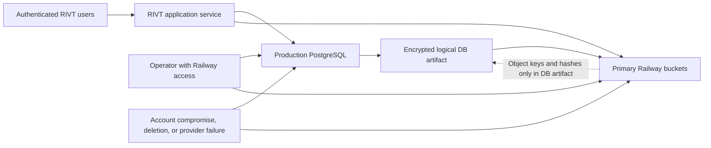
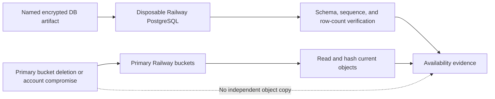
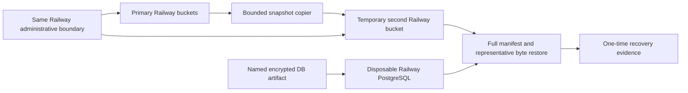
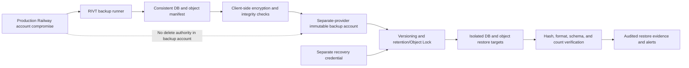

# Security Hardening Proposal: Establish A Complete Recovery Boundary

## Decision

We need to decide whether launch recovery protects only PostgreSQL records, a
one-time copy of the current file corpus, or a durable database-and-object
snapshot held outside the production administrative failure domain.

The current recovery policy promises restoration of PostgreSQL and
object-storage-backed records within four hours. The repository can restore a
named encrypted database artifact, but the artifact contains file keys and
metadata rather than the bytes behind those keys. We therefore cannot treat
the existing database backup as complete recovery.

No option in this proposal has been implemented. No paid provider feature or
temporary resource has been enabled.

## Executive Recommendation

We have three serious options:

1. **Restore-only baseline** — restore the exact encrypted database artifact
   and hash files read from the production bucket. This is useful diagnostic
   evidence, but it does not recover a deleted file.
2. **Full-corpus Railway snapshot** — copy every object referenced by the
   restored snapshot into a blank second Railway bucket, then restore from
   that copy. This can produce honest one-time recovery evidence, but both
   copies remain under the same provider and administrative boundary.
3. **Cross-provider immutable backup** — create coordinated encrypted database
   and object manifests, place them in a separate account/provider with
   versioning and enforced retention, and restore through a separate recovery
   credential. This is the only option here that materially contains a
   compromised production Railway account.

I recommend Option 3 for launch, introduced in stages. We should first build
the bounded verifier locally, then use a tightly capped Option 2 drill to
validate the exact fresh database artifact and the complete 89-object corpus.
That drill gives us operational evidence while the separate immutable
destination is configured and reviewed. We should not call the same-provider
copy the finished backup design.

The immediate provider step has a conservative authorization request of
**US$1.00 maximum incremental Railway usage**. That is an owner approval
boundary, not a prediction that Railway will charge $1 and not a request to
lower the workspace hard limit. A low workspace hard limit could shut down
production.

## Evidence

I inspected the named-artifact scripts, the object upload paths, the schema
relationships for each important media class, the approved recovery policy,
the prior restore record, and current provider documentation. These were the
most decision-relevant inputs:

| Evidence | Finding or document | What it establishes |
| --- | --- | --- |
| `E001` | [RIVT recovery and launch contract](../../../../../RIVT_MASTER_BUILD_PROMPT.md) | A backup is not accepted until a restore drill succeeds; object lifecycle and private access also require proof. |
| `E004` | [Backup and restore deployment evidence](../../../../delivery/DEPLOYMENT_LEDGER.md) | A prior named artifact restored successfully, while the new 109-table artifact remains untested. |
| `E005` | [Packet 88 security and infrastructure boundary](../../../../delivery/packets/88_SECURITY_INFRASTRUCTURE_HARDENING.md) | The fresh artifact is inside the RPO but contains metadata rather than object bytes. |
| `E009`–`E012` | Logical backup creator, cryptography, restorer, and verifier | The database path encrypts, migrates, restores, and count-checks all public tables but does not copy file bodies. |
| `E014`–`E024` | Upload flows and media schemas | Album photos, attachments, document logos, professional evidence, Shop Talk media, and completion evidence have object keys, byte counts, and generally SHA-256 values suitable for verification. |
| `O004` | Read-only production bucket inventory | The current corpus is 89 objects totaling 40,385,105 bytes; no object names or contents were read. |
| `P004` | [Railway storage bucket capabilities](https://docs.railway.com/storage-buckets) | Railway buckets currently do not offer object versioning, Object Lock, lifecycle configuration, or native snapshots/backups. |
| `P008` | [Amazon S3 Object Lock](https://docs.aws.amazon.com/AmazonS3/latest/userguide/object-lock.html) | A separate provider can enforce versioned write-once-read-many retention, including a compliance mode that cannot be shortened during its retention period. |

### Observed

- `scripts/create-logical-backup-artifact.js` serializes every public database
  table and sequence into an AES-256-GCM envelope. It never reads the object
  keys it captures.
- `scripts/restore-logical-backup-artifact.js` requires an isolation
  confirmation, can compare source and target identities, restores in foreign
  key order inside a transaction, restores sequences, and requires strict
  table-count parity by default.
- The fresh artifact records 109 tables and 8,760 rows but has not been
  restored. It embeds `sourceCommit: unknown`; the production commit is a
  separate observation.
- The database stores enough metadata to verify current album photos,
  message/contact attachments, document logos, professional evidence,
  Shop Talk media, and completion evidence without opening customer content.
- Legacy upload rows can lack a SHA-256 value, and `uploads.content_sha256`
  does not globally enforce a 64-character hexadecimal digest.
- The production buckets currently contain 89 objects totaling about
  40.4 MB. This is aggregate provider metadata, not a frozen inventory.

### Inferred

- Reading and hashing a file from the production bucket proves present
  availability. It does not prove we can recover that file after deletion.
- A complete temporary copy followed by a restore from that copy is valid
  one-time recovery evidence, but it does not establish scheduled recurrence,
  historical versions, immutability, or survival of production-account
  compromise.
- Because the database snapshot and object corpus are currently created
  independently, recovery can drift unless a shared snapshot ID and complete
  manifest bind them.
- The same credentials and administrative account can reach both current
  Railway buckets. A single compromised control plane remains a common-mode
  failure.

## Current Design And Failure Mode

The application writes structured records to PostgreSQL and file bodies to
private Railway S3-compatible buckets. PostgreSQL rows retain the file key,
size, MIME type, and usually a SHA-256 digest. The logical backup serializes
those rows and puts the encrypted database envelope into the same object
storage boundary used by the application.

This has a good local integrity story but an incomplete recovery story. If
PostgreSQL is lost while the primary bucket remains available, the named
artifact can rebuild database records. If a file is deleted, overwritten, or
made unavailable with that bucket or administrative account, the database
artifact only tells us which bytes are missing. It does not contain them.

The operator isolation flag also remains an attestation. The restore tool can
reject a matching source and target only when both URLs are supplied. The safe
drill must therefore use private Railway networking, supply the production URL
only as an identity guard, confirm that the target has zero public tables
before migration, and never persist the temporary target URL in application
configuration.

## Desired Invariants

- Every accepted backup has one immutable snapshot ID binding its database
  artifact, source revision, object manifest, object count, total byte count,
  and completion status.
- Every active referenced object in the snapshot is backed up; a four-file
  sample is never represented as full-corpus coverage.
- Every copied and restored object is streamed through SHA-256 and byte-count
  checks without being written to an operator workstation or opened by a
  person.
- Missing objects, hash mismatches, unrecognized formats, or an incomplete
  manifest fail the backup or drill and raise an incident.
- The production application can write new backups but cannot delete or read
  historical immutable backups.
- Recovery credentials are separate from production write credentials and
  are not stored in normal application configuration.
- The backup survives deletion or compromise of the production Railway
  project and its credentials.
- Restore actions can only target a provably distinct, empty, isolated
  database and private object destination.
- Evidence logs contain no database URLs, object keys, account IDs, filenames,
  addresses, message bodies, credentials, or file contents.
- Scheduled backup and restore evidence stays inside the approved 24-hour RPO,
  4-hour RTO, 30-day retention, and 30-day restore-drill cadence—or the
  readiness gate fails.

## Constraints And Non-Goals

- Michael has prohibited any potentially chargeable action without explicit
  approval immediately before it.
- This proposal does not authorize a provider account, service, bucket,
  deployment, PITR setting, plan change, or recurring schedule.
- We must not copy production PII to a developer workstation or repository.
- We must keep ordinary app-to-database traffic on Railway private networking.
- Malware scanning/quarantine is a separate launch blocker. A recovered
  object can be byte-correct and still unsafe.
- Retention, legal hold, DSAR deletion propagation, and provider contract
  approval remain policy and legal decisions rather than conclusions of this
  engineering proposal.
- We are not promising zero cost. Provider metering, growth, concurrent usage,
  taxes, rounding, and delayed deletion are external variables.

## Before Architecture

The [before diagram](../diagrams/complete-recovery-boundary-before.mmd) shows
the shared failure boundary: the database artifact and user file bodies both
depend on Railway object storage and Railway administrative access.

The central weakness is not encryption or access control on a normal request.
It is common-mode authority: the production account is also the only place
where the current recoverable material lives.

## Options

### Option 1: Restore-Only Baseline

Option 1 preserves the existing topology. We restore the exact fresh artifact
into a disposable PostgreSQL target, then read and hash current production
objects. The strongest case for this option is speed: the database tooling
already exists, a prior drill proves the mechanics, and no new long-lived
provider relationship is needed.

Its limitation is decisive. The object check reads from the source we are
supposed to recover. If an object has already been deleted, there is no backup
copy. If the Railway account or bucket is unavailable, the check cannot start.
I would use this only as a diagnostic baseline, never as launch-closure
evidence for object recovery.

[Option 1 after diagram](../diagrams/complete-recovery-boundary-restore-only-baseline-after.mmd)

| Change | Before | After | Security consequence | Cost |
| --- | --- | --- | --- | --- |
| Fresh artifact restore | Untested 109-table artifact | Strict isolated replay and verification | Closes the database-mechanics question only | Temporary database compute/storage |
| Object check | No current byte check | Hashes primary objects | Detects corruption/missing files but cannot recover them | Reads and transient compute |
| Failure domain | One Railway boundary | Still one Railway boundary | Common-mode deletion and account compromise remain | No recurring new provider |

Rollback is straightforward: interrupt the drill and delete only the exact
temporary service and volume IDs. Production needs no data rollback because
the plan performs no production write.

### Option 2: Full-Corpus Railway Snapshot

Option 2 adds a bounded copier and private temporary destination. After the
database artifact is restored, the verifier selects every active referenced
object in that snapshot, streams it from the primary bucket, verifies its
stored size and SHA-256, and writes a complete copy plus encrypted manifest to
a blank temporary Railway bucket. It then restores representative classes
from the temporary copy and verifies them again. At the current 40.4 MB scale,
copying the entire corpus is more honest and simpler than sampling.

This is meaningful evidence. If all referenced bytes are copied and restored
from the second bucket, we have proved one complete backup/restore cycle at
that moment. It also gives us the tooling and privacy-safe evidence format
needed by the final design.

What gives me pause is the administrative boundary. Railway documents no
versioning, Object Lock, lifecycle configuration, or native bucket backup.
The same compromised workspace or operator path can destroy both buckets.
This option is therefore a good migration step and drill harness, but not the
long-term answer to the failure mode we are trying to contain.

[Option 2 after diagram](../diagrams/complete-recovery-boundary-railway-full-corpus-snapshot-after.mmd)

| Change | Before | After | Security consequence | Cost |
| --- | --- | --- | --- | --- |
| Object coverage | Keys and metadata only | Complete bounded copy of all referenced objects | Proves one-time full-corpus recovery | Service egress, bucket storage, temporary compute |
| Integrity | Per-upload metadata, no recovery manifest | Encrypted snapshot manifest and streamed verification | Missing or mismatched objects fail closed | Hashing and manifest storage |
| Failure domain | One bucket/account boundary | Two buckets in one Railway workspace | Helps with accidental source deletion after copy; does not contain workspace compromise | Small temporary bucket |
| Cleanup | No object restore target | Exact temporary IDs and empty-before-delete rule | Limits residual copies and billing | Operator time |

The current provider rates and observed corpus produce a conservative internal
model below US$0.66 for a two-hour target window, including deliberately
pessimistic compute and cleanup allowances. We should still request a US$1
authorization because Railway does not offer a hard per-operation cap and the
current invoice may move. The authorization must forbid plan upgrades, PITR,
public endpoints, persistent variables, and recurring features.

Rollback deletes the temporary bucket contents first, then deletes the exact
bucket, PostgreSQL service, and attached volume IDs. If deletion cannot be
verified, work stops and the incident is escalated; no guessed-name cleanup is
allowed.

### Option 3: Cross-Provider Immutable Backup

Option 3 makes the backup a separate security boundary. A backup runner opens
a consistent database snapshot, creates a shared snapshot ID and encrypted
object manifest, and streams every active referenced object through
client-side encryption and integrity checks into a separate provider account.
The destination enables versioning and enforced retention/Object Lock. The
normal production credential can append new snapshots but cannot list, read,
overwrite, shorten retention, or delete historical snapshots. A separately
held recovery credential performs drills.

This option has the strongest case because it aligns authority with the threat
we care about. A production Railway credential compromise can damage the live
application, but it cannot erase the retained backup. A malformed or partial
backup cannot become the latest accepted recovery point because the completion
manifest is written last and is cryptographically bound to the database and
object inventory.

The operational cost is real but proportionate. We add another provider
account, credential custody, retention configuration, monitoring, and a
recovery runbook. The backup runner must handle retries without accepting a
partial snapshot. Legal and provider review must approve the US region, DPA,
subprocessor, deletion, and incident-notice terms. Client-side encryption also
makes key custody a first-class recovery dependency: losing the key would make
an intact backup useless.

At today's 40.4 MB corpus, a deliberately inefficient daily full copy retained
for 30 days would hold about 1.21 GB before database-artifact size and growth.
Using current published Railway egress and AWS S3 Standard/request rates gives
an illustrative object-only model of roughly US$0.11 per month. This is not an
authorization or invoice promise; compute, database-artifact bytes, retrieval,
tax, future growth, and provider-account choices remain unmeasured. A
content-addressed encrypted blob store with daily manifests could reduce
repeat uploads later, but simplicity should win until volume justifies that
complexity.

[Option 3 after diagram](../diagrams/complete-recovery-boundary-cross-provider-immutable-backup-after.mmd)

| Change | Before | After | Security consequence | Cost |
| --- | --- | --- | --- | --- |
| Administrative boundary | Production and backups share Railway control plane | Separate provider account and recovery credential | Contains production-account compromise | New provider/account operations |
| Retention | Deletable current objects | Versioned immutable retention | Accidental or malicious deletion cannot erase retained versions | Retained storage and requests |
| Snapshot consistency | Database artifact and objects created independently | Shared snapshot ID, repeatable database view, complete object manifest | Prevents an accepted partial or temporally ambiguous recovery point | Backup-runner complexity |
| Encryption authority | One configured backup secret | Client-side envelope encryption with escrow/rotation | Provider compromise does not reveal plaintext; key loss becomes a critical risk | Key custody and rotation |
| Recovery | Ad hoc database-only drill | Scheduled full restore and monitored evidence | Keeps recovery capability current rather than assumed | Regular operator and temporary-resource cost |

Rollback is staged. Before the first immutable retention policy, we can delete
the trial destination and remove credentials. After compliance retention is
enabled, rollback means disabling future writes and letting already-retained
versions expire; those versions intentionally cannot be deleted early.
Therefore retention duration, data classification, and legal deletion
exceptions must be approved before that switch.

## Comparison

| Dimension | Option 1: restore-only | Option 2: Railway full corpus | Option 3: immutable cross-provider |
| --- | --- | --- | --- |
| Security | Database restore plus primary availability check; object deletion remains unrecoverable | One-time complete recovery, but same account/provider can erase both copies | Complete recovery with production-account compromise containment |
| Performance | Restore load only; no normal-path change | Full corpus streaming during drill; bounded outside request paths | Scheduled streaming outside request paths; incremental optimization available later |
| Memory | Existing scripts use bounded DB batches; object verifier must stream | Bounded streaming, no whole-corpus buffer | Bounded streaming and encryption buffers; manifest index grows with object count |
| Reliability | No independent object source | Temporary copy adds retry/cleanup failure modes | Separate provider improves failure isolation but adds provider/network/key dependencies |
| Operability | Lowest; still leaves blocker open | Moderate one-time service/bucket lifecycle | Highest: account, credentials, monitoring, retention, drills, legal/provider ownership |
| Migration | Existing tooling plus tighter preflight | Add local verifier, manifest, full-copy, and cleanup harness | Add consistent snapshots, immutable destination, least-privilege identities, scheduler, alerts, and restore runbook |
| Reversibility | High; delete temporary target | High after emptying temporary bucket | High before retention; intentionally limited after immutable retention begins |
| Launch fit | Insufficient | Useful staged proof, insufficient as sole durable backup | Recommended launch boundary |

The performance and cost directions above are source-derived or hypothetical,
not benchmarks. We will measure backup duration, peak RSS, CPU, object
throughput, retry count, manifest size, and restore duration against the
24-hour RPO and 4-hour RTO before accepting the design.

## Recommendation

I recommend Option 3, with Option 2 used once as its controlled proving stage.
This balances immediate evidence with the long-term failure boundary Michael
asked us to design from the start.

Option 2 should win as the final design only if the owner explicitly accepts
that production-account compromise and provider-wide loss are out of scope.
That would conflict with the stated goal of being credible to senior security
reviewers, so I do not recommend that acceptance.

Option 1 remains worthwhile only as the database portion of the drill. We
should not spend money running an object “restore” that merely reads the
primary bucket and produces a misleading green result.

## Evidence Coverage And Residual Risk

| Evidence | Option 1 | Option 2 | Option 3 | Tactical protection still required |
| --- | --- | --- | --- | --- |
| `E001` — RIVT recovery contract | Mitigates database restore requirement | Mitigates with one-time full recovery | Addresses structural recovery boundary | Keep readiness gate fail-closed |
| `E004` — prior and fresh artifact evidence | Addresses exact fresh DB replay only | Addresses exact DB replay plus current full-corpus copy | Addresses when coordinated immutable snapshot/drill passes | Preserve prior evidence; never rewrite history |
| `E005` — Packet 88 object-byte gap | Unaffected | Mitigates one-time | Addresses durable recovery | Keep R-051 open until implementation proof |
| `E009`–`E012` — logical backup tooling | Mitigates; count parity only | Mitigates; count parity plus object hashes | Addresses after consistent snapshot/content-digest additions | Add source/target identity, empty-target, and content-digest checks |
| `E014`–`E024` — object integrity metadata | Mitigates current files only | Addresses qualifying current objects | Addresses after legacy/no-hash policy and complete manifest | Fail on missing/mismatch; do not silently skip |
| `P004` — Railway bucket feature limits | Unaffected | Unaffected as a common-mode residual risk | Addresses through separate immutable destination | Do not claim same-workspace immutability |

Residual risks remain even under Option 3:

- client-side encryption key loss or compromise;
- a backup runner bug that consistently omits the same class of object;
- legacy rows without reliable hashes;
- retention rules that conflict with approved deletion or legal-hold policy;
- malware preserved faithfully inside an immutable backup;
- provider or network outages during the RPO window;
- restore tooling drift after migrations;
- operator failure to investigate backup or drill alerts.

## Migration And Rollout

The ordered rollout is deliberately reversible:

1. **Decision and approval** — select Option 3, approve the temporary drill
   ceiling separately, and choose the external administrative owner, US
   region, retention mode, and key custodian.
2. **Local-only harness** — implement a deterministic object manifest,
   bounded streaming verifier, privacy-safe evidence logger, exact target
   guards, and mock/local S3 and PostgreSQL tests. This stage touches no
   production data or paid provider resource.
3. **Review gate** — security-review the harness, require zero secret/object
   identifiers in logs, and confirm every storage scope is covered.
4. **Capped Railway proving drill** — after explicit US$1 approval, create one
   capped non-public PostgreSQL sibling and one blank temporary private
   bucket, restore the exact fresh artifact, copy and verify every qualifying
   referenced object, restore representative categories from the copy, and
   delete all temporary resources by exact ID.
5. **Immutable destination trial** — configure a separate provider account
   with versioning, client-side encryption, least-privilege append-only backup
   identity, separate recovery identity, and a short governance retention
   trial before compliance retention.
6. **Coordinated backup** — create a new snapshot with `REPEATABLE READ`,
   shared snapshot ID, source commit, database content digests, complete object
   manifest, and completion marker written last.
7. **Scheduled operation** — run daily inside the 24-hour RPO, alert on missed,
   partial, old, missing-object, mismatch, and provider failures, and keep 30
   days.
8. **Full drill** — monthly isolated database replay plus object recovery from
   the immutable destination, timed against the 4-hour RTO.
9. **Acceptance** — update recovery policy, R-051, traceability, and deployment
   evidence only after the exact-source implementation and provider proof pass.

If any phase fails, stop before the next authority boundary. Do not weaken
strict comparisons or copy only a convenient sample to make the gate pass.

## Validation Plan

- Unit-test manifest canonicalization, HMAC/object-key redaction, streaming
  SHA-256, size limits, MIME/magic-byte checks, retries, and completion-marker
  behavior.
- Integration-test every current storage scope against local disposable
  PostgreSQL and a mocked or disposable S3-compatible endpoint.
- Assert source and target database identity differ and the target starts
  with zero public tables before migrations.
- Add canonical per-table content digests so equal counts cannot hide
  different restored values.
- Create future database artifacts inside one read-only `REPEATABLE READ`
  transaction and prove concurrent writes do not produce a mixed snapshot.
- In the authorized drill, require the exact artifact key, creation timestamp,
  109 tables, 8,760 rows, zero count differences, zero pending migrations, and
  no public target endpoint.
- Inventory all referenced objects from the restored snapshot. Require every
  qualifying object to copy and hash successfully; report a legacy/no-hash row
  explicitly rather than skipping it.
- Restore at least one available album photo, attachment, document logo, and
  completion/professional evidence object from the independent copy. If a
  class has no qualifying object, report that fact; do not fabricate data.
- Never view customer content. Verify byte count, digest, MIME class, and
  magic signature only.
- Capture backup duration, restore duration, peak RSS, CPU, copied bytes,
  object count, retry count, and cleanup status without sensitive identifiers.
- Verify public `/api/health` before, during, and after the drill; abort if
  production degrades.
- Verify the temporary service, volume, bucket, variables, domain, and TCP
  proxy are absent after cleanup.
- Simulate provider failure, missing source object, hash mismatch, expired
  credentials, locked object deletion, partial manifest, and alert-delivery
  failure before acceptance.

## Implementation Work Packages

These are design work packages, not authorization to implement:

- Harden database snapshot consistency and add canonical content digests.
- Build the object inventory and encrypted manifest format.
- Build bounded full-corpus backup and representative restore verification.
- Add privacy-safe structured recovery evidence and incident events.
- Add exact provider-resource inventory and teardown guards.
- Configure the separate immutable provider/account and credential split.
- Add daily scheduling, missed-backup alerting, and 30-day retention.
- Add monthly isolated restore automation and readiness integration.
- Backfill or explicitly classify legacy uploads without trustworthy hashes.
- Reconcile missing/orphaned objects and align deletion, legal hold, and backup
  purge behavior.

An implementation handoff is intentionally not present. The hardening
workflow requires an owner-selected option before implementation planning.

## Open Questions

1. Does Michael approve Option 3 as the target architecture?
2. Does Michael authorize up to US$1.00 of incremental Railway usage for the
   one-time proving drill after the local harness is reviewed?
3. Which separate provider/account should own immutable backups? AWS S3
   Compliance Object Lock is the current recommendation; an equivalent
   provider must demonstrate enforceable retention and separate credentials.
4. Who holds the offline recovery credential and backup encryption-key escrow,
   and how is access recovered if that person is unavailable?
5. Is 30-day immutable retention approved for every object class, or do legal
   hold, professional evidence, and customer deletion require different
   schedules?
6. Which US region and provider DPA/subprocessor terms will legal and
   operations approve?
7. How should legacy objects without SHA-256 be backfilled or quarantined from
   a “fully verified” snapshot?
